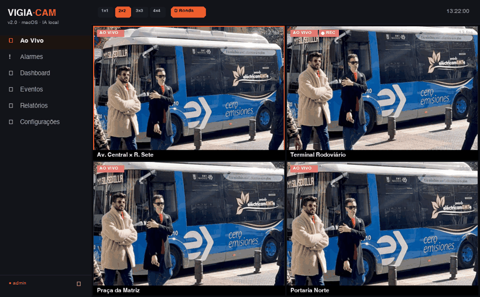

# VIGIA·CAM


Plataforma **VMS (Video Management System)** nativa para **macOS** que monitora
múltiplas câmeras **RTSP/HLS** ao vivo em videowall, com **detecção de objetos por
IA em tempo real** (YOLOv8n via Vision/CoreML no Neural Engine) e recursos de nível
corporativo pensados para **editais de CFTV e segurança pública** — tudo **100% local**.

🔗 **Página do projeto:** https://dheiver2.github.io/vigia-cam/



## Funcionalidades

| Recurso | Descrição |
|---|---|
| **Videowall & Ronda** | Mosaicos 1×1 a 4×4, paginação por categoria, rodízio automático (ronda) e tela cheia |
| **Detecção por IA** | YOLOv8n on-device (Vision/CoreML), pessoas/veículos e 80+ classes em tempo real |
| **Alarmes inteligentes** | Regras por classe/limite/câmera (intrusão, aglomeração) com banner ao vivo, som e log |
| **Evidência forense** | Snapshot e gravação MP4 com carimbo, hash SHA-256 e cadeia de custódia |
| **Privacidade LGPD** | Máscaras de privacidade por câmera, aplicadas ao vivo e nas gravações |
| **Relatórios PDF** | Relatório paginado de eventos por período, com autoria e totais |
| **Controle de acesso** | Perfis admin/operador/visualizador (PBKDF2) + trilha de auditoria |
| **Dados criptografados** | Configurações e usuários com AES-GCM (chave no Keychain) |
| **Conexão resiliente** | Reconexão automática com backoff + watchdog de travamento |

Login padrão no primeiro uso: **admin / admin** (troque em produção).
Todos os dados ficam em `~/Documents/VigiaCam`.

## Como compilar e rodar

Requer **macOS 14+** e a toolchain do Swift (Xcode ou Command Line Tools).

```bash
./build.sh      # compila (swift build -c release), monta VigiaCam.app e abre
```

Ou manualmente:

```bash
cd VigiaCam
swift build -c release
swift run
```

## Testes

```bash
cd VigiaCam
./run_tests.sh    # testes de lógica pura — rodam SEM Xcode (Command Line Tools)
swift test        # suíte XCTest completa — requer Xcode
```

`run_tests.sh` compila os fontes reais (Camera, AppConfig, AlarmRule) com um
runner de asserções e cobre normalização de câmeras, validação/clamp de
configuração e casamento de regras de alarme. A suíte XCTest adiciona
CryptoService (AES-GCM), RBAC e StorageService.

## Arquitetura

```
VigiaCam/Sources/VigiaCam/
├── App/                    # entrada + navegação (ContentView)
├── Core/
│   ├── Security/           # RBAC (PBKDF2) + CryptoService (AES-GCM)
│   └── Storage/            # arquivos, eventos CSV, auditoria, cadeia de custódia
├── Features/
│   ├── Live/               # videowall (layouts, ronda, tela cheia)
│   ├── Detection/          # YOLOv8n (Vision/CoreML, parsing + NMS)
│   ├── Alarms/             # motor de regras + painel
│   ├── Recording/          # snapshot + gravação de clipes
│   ├── Privacy/            # zonas de privacidade (LGPD)
│   ├── Reports/            # relatórios PDF
│   ├── Cameras/            # captura HLS/RTSP, cards, viewer
│   ├── Events/ Dashboard/ Config/ Auth/
└── UI/                     # tema e componentes
```

## ⚠️ Uso responsável

Use apenas com streams que você tem autorização para acessar (câmeras próprias,
feeds públicos oficiais ou streams de teste). Acessar câmeras de terceiros sem
autorização é invasão de privacidade e pode configurar crime (LGPD + art. 154-A
do Código Penal).

## Licença

MIT — © Dheiver Santos
