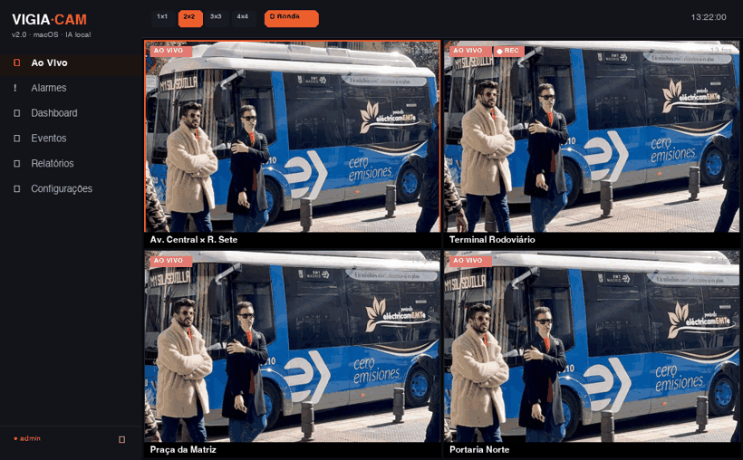

# VIGIA·CAM


Native **VMS (Video Management System)** platform for **macOS** that monitors
multiple **RTSP/HLS** cameras on a live videowall, with **real-time AI object
detection** (YOLOv8n via Vision/CoreML on Neural Engine) and enterprise-grade
features built for **CCTV and public security** — all **100% local**.

🔗 **Project page:** https://dheiver2.github.io/vigia-cam/



## Features

| Feature | Description |
|---|---|
| **Videowall & Tour** | 1×1 to 4×4 layouts, category paging, auto rotation (tour), fullscreen |
| **AI Detection** | YOLOv8n on-device (Vision/CoreML), people/vehicles and 80+ classes in real time |
| **Smart Alarms** | Class/threshold/camera rules (intrusion, crowding) with live banner, sound, log |
| **Forensic Evidence** | Snapshots and MP4 recordings with timestamp, SHA-256 hash, chain of custody |
| **Privacy Masking** | Per-camera privacy masks applied live and in recordings |
| **PDF Reports** | Paged event reports by date range, with metadata and totals |
| **Encrypted Data** | Settings with AES-GCM (key in Keychain) |
| **Resilient Connection** | Auto-reconnect with backoff + watchdog |

All data is stored in `~/Documents/VigiaCam`.

## How to build and run

Requires **macOS 14+** and the Swift toolchain (Xcode or Command Line Tools).

```bash
./build.sh      # compiles (swift build -c release), bundles VigiaCam.app and opens it
```

Or manually:

```bash
cd VigiaCam
swift build -c release
swift run
```

## Tests

```bash
cd VigiaCam
./run_tests.sh    # pure logic tests — run WITHOUT Xcode (Command Line Tools)
swift test        # full XCTest suite — requires Xcode
```

`run_tests.sh` compiles the real sources (Camera, AppConfig, AlarmRule) with an
assertion runner and covers camera normalization, config validation/clamping,
and alarm rule matching. The XCTest suite adds CryptoService (AES-GCM), RBAC,
and StorageService.

## Architecture

```
VigiaCam/Sources/VigiaCam/
├── App/                    # entry point + navigation (ContentView)
├── Core/
│   ├── Security/           # RBAC (PBKDF2) + CryptoService (AES-GCM)
│   └── Storage/            # files, CSV events, audit log, chain of custody
├── Features/
│   ├── Live/               # videowall (layouts, tour, fullscreen)
│   ├── Detection/          # YOLOv8n (Vision/CoreML, parsing + NMS)
│   ├── Alarms/             # rule engine + panel
│   ├── Recording/          # snapshots + clip recordings
│   ├── Privacy/            # privacy zones (LGPD)
│   ├── Reports/            # PDF reports
│   ├── Cameras/            # HLS/RTSP capture, cards, viewer
│   ├── Events/ Dashboard/ Config/ Auth/
└── UI/                     # theme and components
```

## ⚠️ Responsible Use

Only use streams you are authorized to access (your own cameras, official public
feeds, or test streams). Accessing third-party cameras without authorization is
a privacy violation and may constitute a crime.

## License

MIT — © Dheiver Santos
